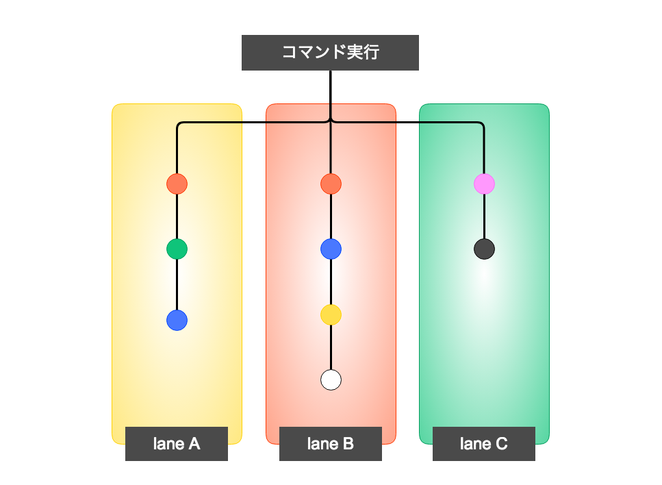

<!-- 
$theme: gaia
template: invert
-->

Fastlane 入門
===

#### 2018/09/16 

#### 第28回 岡山モバイルアプリ開発もくもく会

###### Created by 高橋 一騎 ( [@ikkitang](https://github.com/ikkitang) )

---

<!-- page_number: true -->

# おしながき

---

# おしながき

1. **あばうとみー**
1. **Fastlaneについて**　
1. **まとめ**

---

# 1. あばうとみー

## 高橋　一騎 (_ takahashi ikki )

- 岡山でWebエンジニア
- PHPer 🐘 、 Pythonista 🐍 、Swift好き 🐣
- JPUG中国支部長
- Twitter @ikkitang 

---

<!-- prerender: true -->

# 婚活といえばオミカレ

## https://party-calendar.net/


---

<!-- prerender: true -->

## 中国地方DB勉強会 in 広島
### 2018/09/29 (土) 
### https://dbstudychugoku.connpass.com/event/94746/

### 来てくれ！ 頼むっ😭

---

# 2. Fastlaneについて

--- 

# 🎉 iOSDC Japan 2018 🎉
#### https://iosdc.jp/2018/


--- 

# iOSDC Japan 2018

[紹介Fastfile](https://speakerdeck.com/giginet/xiang-jie-fastfile)

### Fastfileの書き方についてのベストプラクティスの紹介。

めっちゃよかった。

結論： Fastfileを書かない！

---

## ビルド設定のベスト・プラクティス
##### ※ 紹介Fastfileより引用


---

## 是非、見てほしい！

---

# Fastlaneについて

- [fastlane/fastlane](https://github.com/fastlane/fastlane)
  - Ruby製のタスクランナー
  - 公式Doc: [https://docs.fastlane.tools/ ](https://docs.fastlane.tools/)
- fastlaneは、iOSやAndroidアプリのベータ版の導入やリリースを自動化する最も簡単な方法です。 スクリーンショットの生成、コード署名の処理、アプリケーションのリリースなど、すべての面倒な作業を処理します。

---

# アプリ開発の辛み

- ビルドとかAppStoreへの申請が属人化しがち。
- スクリーンショットについて変更の度にデザイナーと話したり面倒。
- コード署名の管理超面倒くさい。
- アプリケーションのバージョン管理面倒くさい
  
### => その辺 Fastlane で解決出来ますよ？

---

# Fastlane の概念



---

## Action の大まかな分類(抜粋)

- Testing
- Building
- Screenshots
- Project
- Code Signing
- Beta
- Push
- Releasing your app
- etc...


---

## Action の大まかな分類(抜粋)

###  ==Testing==

- scan
  - XCodeの自動テストを実行
- swiftlint
  - Swiftlintを実行する
- appium
  - appium や rspec を実行する

---

## Action の大まかな分類(抜粋)

### ==building==

- gym ( build_ios_app )
  - アプリのビルドをする
- cocoapods
  - `pod install` を実行する

---

## Action の大まかな分類(抜粋)


### ==Screenshots==

- snapshot
  - UITestが動いてスクショが撮れる.
  - App Store公開用のスクリーンショットの自動化とか出来る。

### ==Project==

- increment_build_number
  - ビルド番号を自動で上げる

---

## Action の大まかな分類(抜粋)

### ==Code Signing==

- sign ( get_provisioning_profile )
  - provisioning profile のダウンロード
- cert ( get_certificates )
  - 証明書を生成してkeychainに登録する
- register_device ( register_devices )
  - iOS端末を登録する

---

## Action の大まかな分類(抜粋)

### ==Beta==

- ベータ版の配信を行う事が出来る
  - 対応サービス無限にありそう
  - TestFlight / Crashlytics / DeployGate

### ==Push==

- pem ( get_push_certificate )
  - プッシュ通知証明書を生成する

---

## Action の大まかな分類(抜粋)

### ==Releasing your app==

- deliver ( upload_to_app_store )
- supply ( upload_to_play_store )
  - 各対応のアプリリリースプラットフォームにipa/apkをアップロード

---

## Action の大まかな分類(抜粋)

### ==その他==

- Notifications/slack 
  - slackへ通知する
  - 他にも chartwork/mailgunとかある
- App Store Connect/produce
  - 新規のAppStore更新Versionを作成する。

--- 

## インストール方法

- bundlerをインストール

```
$ gem install bundler
```

- Gemfileを編集

```ruby
source "https://rubygems.org"
gem 'fastlane'
```

- fastlane をinstall

```
$ bundle install --path vendor/bundle
```

--- 

## セットアップ

- bundlerを初期セット

```
$ bundle exec fastlane init
```

- 質問答えていく
  - 今回は`App Storeへ自動リリースする`を選択した。
  - アプリの identifier とか設定しておくと、自動で取得してくれる
  - AppStoreへ公開済みのアプリに対してインストールするとScreenshot等も自動ダウンロードしてくれた。

--- 

## セットアップ

- bundlerを初期セット

```
$ bundle exec fastlane init
```

- 質問答えていく
  - 今回は`App Storeへ自動リリースする`を選択した。
  - アプリの identifier とか設定しておくと、自動で取得してくれる
  - AppStoreへ公開済みのアプリに対してインストールするとScreenshot等も自動ダウンロードしてくれた。

---


## Demo

<video controls="controls" width="900" height="500" style="background: #0F0F0F;">
  <source src="./demo/fastlane_demo_tests.mov">
</video>

--- 

## ソース解説

- Fastfileにlaneを定義

```ruby
lane :tests do
  run_tests(scheme:"QuickQRReaderTests")
end
```

- 定義した lane `tests` を指定して fastlane を実行

```
$ bundle exec fastlane tests
```

---

## その他

- Slackにテスト結果を通知する事も可能.

```ruby
lane :tests do
  run_tests(scheme:"QuickQRReaderTests",
            slack_url: "https://hooks.slack.com/xx..",
            slack_channel: "#general")
end
```

`bundle exec tests` ↓↓


--- 

# 3. まとめ

--- 

# 3. まとめ

- Fastlane を使えば大抵の事は自動化できる。
- チーム開発に導入してOperationの自動化や簡略化を実現していこう！
- 今回紹介し切れなかったコマンドはまたデモしたいと思います！